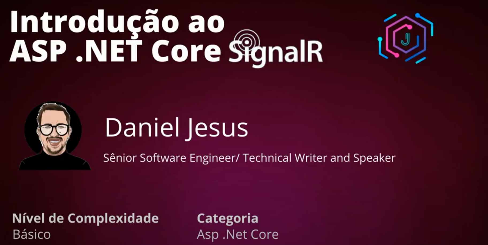

<h1 align="center">
    Introdução ao ASP.NET Core SignalR
</h1>

  <a href="#-tecnologias">Tecnologias</a>&nbsp;&nbsp;&nbsp;|&nbsp;&nbsp;&nbsp;
  <a href="#-projeto">Projeto</a>&nbsp;&nbsp;&nbsp;|&nbsp;&nbsp;&nbsp;
  <a href="#-curso">Curso</a>

 

  

## 🚀 Tecnologias

Esse projeto foi desenvolvido com as seguintes tecnologias:

- [.NET Core 3.1](https://dotnet.microsoft.com/)

## 💻 Projeto

Através desse curso, falar do poderoso SignalR que é um framework de código aberto para aplicações em tempo real que foi desenvolvido pela empresa Microsoft e uma aplicação como exemplo.

## 🔖 Curso

No link abaixo você encontra o curso.

- [Introdução ao ASP.NET Core SignalR](https://www.youtube.com/watch?v=Jwoo5qy8hPM&list=PLfpYVugeLJLY06Q6Z5Y-tz8gOPZ8U4TKq&index=1)

---

Werley Silva